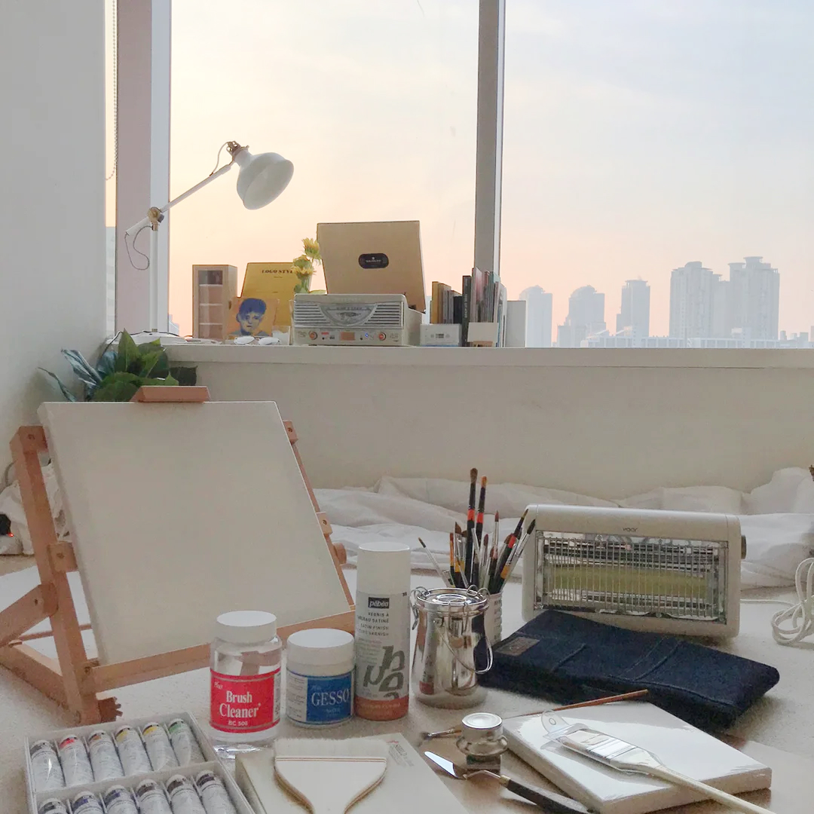

# 내일의 집

### 1. GNB

* 로그인을 하지 않은 경우

``` html

<div class="button-group">
	<button class="gnb-icon-button is-search" type="button" aria-hidden="검색창 열기 버튼"><i class="ic-search"></i></button>
	<a class="gnb-icon-button is-cart" href="/" aria-hidden="장바구니 페이지로 이동">
		<i class="ic-cart"></i>
	</a>
	<div class="gnb-auth sm-hidden">
		<a href="/">로그인</a>
		<a href="/">회원가입</a>
	</div>
</div>

```

* 로그인을 했을 경우

``` html

<div class="button-group">
	<div class="button-group">
		<button class="gnb-icon-button is-search lg-hidden" type="button" aria-hidden="검색창 열기 버튼"><i class="ic-search"></i></button>
		<a class="gnb-icon-button sm-hidden" href="/" aria-hidden="스크랩북 페이지로 이동"><i class="ic-bookmark"></i></a>
		<a class="gnb-icon-button sm-hidden" href="/" aria-label="내 소식 페이지로 이동"><i class="ic-bell"></i></a>
		<a class="gnb-icon-button is-cart" href="/" aria-hidden="장바구니 페이지로 이동">
			<i class="ic-cart"></i>
			<strong class="badge">999</strong>
		</a>
		<button class="gnb-icon-button sm-hidden" type="button" aria-hidden="마이메뉴 열기 버튼"><div class="avatar-32"></div></button>
	</div>
</div>

```

### 2. Sidebar

* 로그인을 하지 않은 경우

``` html

<div class="sidebar-auth">
	<a class="btn-outlined btn-40" href="/">로그인</a>
	<a class="btn-primary btn-40" href="/">회원가입</a>
</div>

```

* 로그인을 한 경우

``` html

<div class="sidebar-user">
	<a href="/">
		<div class="avatar-24">
		
		</div>
		<strong class="username">사달라</strong>
	</a>
</div>

```

### 4. product-section-divider

* 최근 검색어가 있을 경우

``` html

<section id="product-review" class="product-section product-review" role="tabpanel"> <!-- is-open -->
	<header class="product-section-header">
		<h1 class="title">리뷰</h1>
		<strong class="badge" aria-label="0개">566</strong>
		<a class="text-button" href="/">리뷰쓰기</a>
	</header>
	<div class="product-section-content">
		<div class="review-scoreboard">
			<div class="score-summary">
				<strong class="average-score" aria-label="평점 4.8">4.8</strong>
				<div class="star-rating">
					<i class="ic-star is-active"></i>
					<i class="ic-star is-active"></i>
					<i class="ic-star is-active"></i>
					<i class="ic-star is-active"></i>
					<i class="ic-star is-active"></i>
				</div>
			</div>
			<div class="score-detail">
				<dl class="score-stats-list">
					<div class="score-stats-item is-active">
						<dt>5점</dt>
						<dd>
							<div class="bar-graph" aria-hidden>
								<div class="active-bar"></div>
							</div>
							<strong class="count" aria-label="467명">467</strong>
						</dd>
					</div>
					<div class="score-stats-item">
						<dt>4점</dt>
						<dd>
							<div class="bar-graph" aria-hidden>
								<div class="active-bar"></div>
							</div>
							<strong class="count" aria-label="87명">87</strong>
						</dd>
					</div>
					<div class="score-stats-item">
						<dt>3점</dt>
						<dd>
							<div class="bar-graph" aria-hidden>
								<div class="active-bar"></div>
							</div>
							<strong class="count" aria-label="13명">13</strong>
						</dd>
					</div>
					<div class="score-stats-item">
						<dt>2점</dt>
						<dd>
							<div class="bar-graph" aria-hidden>
								<div class="active-bar"></div>
							</div>
							<strong class="count" aria-label="0명">0</strong>
						</dd>
					</div>
					<div class="score-stats-item">
						<dt>1점</dt>
						<dd>
							<div class="bar-graph" aria-hidden>
								<div class="active-bar"></div>
							</div>
							<strong class="count" aria-label="0">0</strong>
						</dd>
					</div>
				</dl>
			</div>
		</div>
		<ol class="review-list">
			<li class="review-item">
				<article class="review-card">
					<header class="review-card-header">
						<h3 class="visually-hidden">김버그 님이 작성한 리뷰</h3>
						<a class="avatar-24" href="/"></a>
						<div class="info">
							<a class="username" href="/"><strong>김버그</strong></a>
							<div class="detail">
								<div class="star-rating-13" aria-label="5.0점 / 5.0점">
									<i class="ic-star is-active"></i>
									<i class="ic-star is-active"></i>
									<i class="ic-star is-active"></i>
									<i class="ic-star is-active"></i>
									<i class="ic-star is-active"></i>
								</div>
								<div class="misc">
									<time datetime="2021-01-01">2021.01.01</time>
									<span>오늘의집 구매</span>
								</div>
							</div>
						</div>
					</header>
					<div class="review-card-body">
						<p>리뷰가 들어갑니다. 리뷰가 들어갑니다. 리뷰가 들어갑니다. 리뷰가 들어갑니다. 리뷰가 들어갑니다. 리뷰가 들어갑니다. 리뷰가 들어갑니다. 리뷰가 들어갑니다. 리뷰가 들어갑니다. 리뷰가 들어갑니다. 리뷰가 들어갑니다. 리뷰가 들어갑니다. 리뷰가 들어갑니다. 리뷰가 들어갑니다. 리뷰가 들어갑니다. 리뷰가 들어갑니다. 리뷰가 들어갑니다. 리뷰가 들어갑니다. 리뷰가 들어갑니다. 리뷰가 들어갑니다. 리뷰가 들어갑니다. 리뷰가 들어갑니다.</p>
					</div>
					<footer class="review-card-footer">
						<button class="btn-outlined btn-32" type="button">도움이 돼요</button>
						<p><strong><span>7</span>명</strong>에게 도움이 되었습니다.</p>
					</footer>
				</article>
			</li>
			<li class="review-item">
				<article class="review-card">
					<header class="review-card-header">
						<h3 class="visually-hidden">뭐야이거 님이 작성한 리뷰</h3>
						<a class="avatar-24" href="/"></a>
						<div class="info">
							<a class="username" href="/"><strong>뭐야이거</strong></a>
							<div class="detail">
								<div class="star-rating-13" aria-label="5.0점 / 5.0점">
									<i class="ic-star is-active"></i>
									<i class="ic-star is-active"></i>
									<i class="ic-star is-active"></i>
									<i class="ic-star is-active"></i>
									<i class="ic-star is-active"></i>
								</div>
								<div class="misc">
									<time datetime="2021-01-01">2021.01.01</time>
									<span>오늘의집 구매</span>
								</div>
							</div>
						</div>
					</header>
					<div class="review-card-body">
						<div class="review-image">
							
						</div>
						<p>리뷰가 들어갑니다. 리뷰가 들어갑니다. 리뷰가 들어갑니다. 리뷰가 들어갑니다. 리뷰가 들어갑니다. 리뷰가 들어갑니다. 리뷰가 들어갑니다. 리뷰가 들어갑니다. 리뷰가 들어갑니다. 리뷰가 들어갑니다. 리뷰가 들어갑니다. 리뷰가 들어갑니다. 리뷰가 들어갑니다. 리뷰가 들어갑니다. 리뷰가 들어갑니다. 리뷰가 들어갑니다. 리뷰가 들어갑니다. 리뷰가 들어갑니다. 리뷰가 들어갑니다. 리뷰가 들어갑니다. 리뷰가 들어갑니다. 리뷰가 들어갑니다.</p>
					</div>
					<footer class="review-card-footer">
						<button class="btn-outlined btn-32" type="button">도움이 돼요</button>
						<p><strong><span>7</span>명</strong>에게 도움이 되었습니다.</p>
					</footer>
				</article>
			</li>
			<li class="review-item">
				<article class="review-card">
					<header class="review-card-header">
						<h3 class="visually-hidden">우유파이 님이 작성한 리뷰</h3>
						<a class="avatar-24" href="/" aria-label="우유파이 님의 프로필로 이동"></a>
						<div class="info">
							<a class="username" href="/"><strong>우유파이</strong></a>
							<div class="detail">
								<div class="star-rating-13" aria-label="5.0점 / 5.0점">
									<i class="ic-star is-active"></i>
									<i class="ic-star is-active"></i>
									<i class="ic-star is-active"></i>
									<i class="ic-star is-active"></i>
									<i class="ic-star"></i>
								</div>
								<div class="misc">
									<time datetime="2021-01-01">2021.01.01</time>
									<span>오늘의집 구매</span>
								</div>
							</div>
						</div>
					</header>
					<div class="review-card-body">
						<p>리뷰가 들어갑니다. 리뷰가 들어갑니다. 리뷰가 들어갑니다. 리뷰가 들어갑니다. 리뷰가 들어갑니다. 리뷰가 들어갑니다. 리뷰가 들어갑니다. 리뷰가 들어갑니다. 리뷰가 들어갑니다. 리뷰가 들어갑니다. 리뷰가 들어갑니다. 리뷰가 들어갑니다. 리뷰가 들어갑니다. 리뷰가 들어갑니다. 리뷰가 들어갑니다. 리뷰가 들어갑니다. 리뷰가 들어갑니다. 리뷰가 들어갑니다. 리뷰가 들어갑니다. 리뷰가 들어갑니다. 리뷰가 들어갑니다. 리뷰가 들어갑니다.</p>
					</div>
					<footer class="review-card-footer">
						<button class="btn-outlined btn-32" type="button">도움이 돼요</button>
						<p><strong><span>7</span>명</strong>에게 도움이 되었습니다.</p>
					</footer>
				</article>
			</li>
			<li class="review-item">
				<article class="review-card">
					<header class="review-card-header">
						<h3 class="visually-hidden">쿠쿠 님이 작성한 리뷰</h3>
						<a class="avatar-24" href="/"></a>
						<div class="info">
							<a class="username" href="/"><strong>쿠쿠</strong></a>
							<div class="detail">
								<div class="star-rating-13" aria-label="5.0점 / 5.0점">
									<i class="ic-star is-active"></i>
									<i class="ic-star is-active"></i>
									<i class="ic-star is-active"></i>
									<i class="ic-star"></i>
									<i class="ic-star"></i>
								</div>
								<div class="misc">
									<time datetime="2021-01-01">2021.01.01</time>
									<span>오늘의집 구매</span>
								</div>
							</div>
						</div>
					</header>
					<div class="review-card-body">
						<p>리뷰가 들어갑니다. 리뷰가 들어갑니다. 리뷰가 들어갑니다. 리뷰가 들어갑니다. 리뷰가 들어갑니다. 리뷰가 들어갑니다. 리뷰가 들어갑니다. 리뷰가 들어갑니다. 리뷰가 들어갑니다. 리뷰가 들어갑니다. 리뷰가 들어갑니다. 리뷰가 들어갑니다. 리뷰가 들어갑니다. 리뷰가 들어갑니다. 리뷰가 들어갑니다. 리뷰가 들어갑니다. 리뷰가 들어갑니다. 리뷰가 들어갑니다. 리뷰가 들어갑니다. 리뷰가 들어갑니다. 리뷰가 들어갑니다. 리뷰가 들어갑니다.</p>
					</div>
					<footer class="review-card-footer">
						<button class="btn-primary btn-32" type="button"><i class="ic-check" aria-hidden></i> 도움됨</button>
						<p><strong><span>7</span>명</strong>에게 도움이 되었습니다.</p>
					</footer>
				</article>
			</li>
			<li class="review-item">
				<article class="review-card">
					<header class="review-card-header">
						<h3 class="visually-hidden">말랑 님이 작성한 리뷰</h3>
						<a class="avatar-24" href="/"></a>
						<div class="info">
							<a class="username" href="/"><strong>말랑</strong></a>
							<div class="detail">
								<div class="star-rating-13" aria-label="5.0점 / 5.0점">
									<i class="ic-star is-active"></i>
									<i class="ic-star is-active"></i>
									<i class="ic-star is-active"></i>
									<i class="ic-star is-active"></i>
									<i class="ic-star is-active"></i>
								</div>
								<div class="misc">
									<time datetime="2021-01-01">2021.01.01</time>
									<span>오늘의집 구매</span>
								</div>
							</div>
						</div>
					</header>
					<div class="review-card-body">
						<p>리뷰가 들어갑니다. 리뷰가 들어갑니다.</p>
					</div>
					<footer class="review-card-footer">
						<button class="btn-outlined btn-32" type="button">도움이 돼요</button>
					</footer>
				</article>
			</li>
		</ol>
		<div class="pagination">
			<!-- <button class="page-control page-prev"><i class="ic-chevron"></i></button> -->
			<ol class="page-list">
				<li class="page-item is-active"><a href="/">1</a></li>
				<li class="page-item"><a href="/">2</a></li>
				<li class="page-item"><a href="/">3</a></li>
				<li class="page-item"><a href="/">4</a></li>
				<li class="page-item"><a href="/">5</a></li>
			</ol>
			<button class="page-control page-next"><i class="ic-chevron"></i></button>
		</div>
	</div>
</section>

```

* 리뷰가 없는 경우

``` html

<section id="product-review" class="product-section product-review" role="tabpanel">
	<header class="product-section-header">
		<h1 class="title">리뷰</h1>
		<strong class="badge" aria-label="0개">0</strong>
		<a class="text-button" href="/">리뷰쓰기</a>
	</header>
	<div class="product-section-content">
		<p class="review-empty">
			첫 리뷰를 남겨주세요!<br>
			최대 <strong>500P</strong>를 드립니다.
		</p>
	</div>
</section>

```

* 문의가 있는 경우

``` html

<section id="product-inquiry" class="product-section product-inquiry is-open" role="tabpanel"> <!-- is-open -->
	<header class="product-section-header">
		<h1 class="title">문의</h1>
		<strong class="badge" aria-label="96개">96</strong>
		<a class="text-button" href="/">문의하기</a>
		<button class="icon-button sm-only" type="button" aria-label="더보기"><i class="ic-chevron" aria-hidden></i></button>
	</header>
	<div class="product-section-content">
		<ol class="inquiry-list">
			<li class="inquiry-item">
				<article class="inquiry-card">
					<header class="inquiry-card-header">
						<h3 class="visually-hidden">지* 님이 남기신 문의</h3>
						<dl class="detail">
							<dt class="visually-hidden">구매 여부</dt>
							<dd>구매</dd>
							<dt class="visually-hidden">문의 유형</dt>
							<dd>상품</dd>
							<dt class="visually-hidden">답변 여부</dt>
							<dd>미답변</dd>
						</dl>
						<div class="misc">
							<strong>지*</strong>
							<time datetime="2021-01-21 21:41">2021년 1월 2일 21시 41분</time>
						</div>
					</header>
					<div class="inquiry-card-body">
						<div class="inquiry-content">
							<span aria-label="문의 내용">Q</span>
							<p>문의글이 들어갑니다. 문의글이 들어갑니다. 문의글이 들어갑니다. 문의글이 들어갑니다. 문의글이 들어갑니다. 문의글이 들어갑니다. 문의글이 들어갑니다. 문의글이 들어갑니다.</p>
						</div>
					</div>
				</article>
			</li>
			<li class="inquiry-item">
				<article class="inquiry-card">
					<header class="inquiry-card-header">
						<h3 class="visually-hidden">홍시* 님이 남기신 문의</h3>
						<dl class="detail">
							<dt class="visually-hidden">구매 여부</dt>
							<dd>구매</dd>
							<dt class="visually-hidden">문의 유형</dt>
							<dd>상품</dd>
							<dt class="visually-hidden">답변 여부</dt>
							<dd>미답변</dd>
						</dl>
						<div class="misc">
							<strong>홍시*</strong>
							<time datetime="2021-01-01 21:41">2021년 1월 1일 21시 41분</time>
						</div>
					</header>
					<div class="inquiry-card-body">
						<div class="inquiry-content">
							<span aria-label="문의 내용">Q</span>
							<p><i class="ic-lock" aria-hidden></i> 비밀글입니다.</p>
						</div>
					</div>
				</article>
			</li>
			<li class="inquiry-item">
				<article class="inquiry-card">
					<header class="inquiry-card-header">
						<h3 class="visually-hidden">샤* 님이 남기신 문의</h3>
						<dl class="detail">
							<dt class="visually-hidden">구매 여부</dt>
							<dd>구매</dd>
							<dt class="visually-hidden">문의 유형</dt>
							<dd>상품</dd>
							<dt class="visually-hidden">답변 여부</dt>
							<dd>답변</dd>
						</dl>
						<div class="misc">
							<strong>샤*</strong>
							<time datetime="2021-01-01 21:41">2021년 1월 1일 21시 41분</time>
						</div>
					</header>
					<div class="inquiry-card-body">
						<div class="inquiry-content">
							<span aria-label="문의 내용">Q</span>
							<p>답변이 달리는 문의글입니다. 답변이 달리는 문의글입니다. 답변이 달리는 문의글입니다. 답변이 달리는 문의글입니다. 답변이 달리는 문의글입니다. 답변이 달리는 문의글입니다. 답변이 달리는 문의글입니다. 답변이 달리는 문의글입니다.</p>
						</div>
						<div class="inquiry-content">
							<span aria-label="답변 내용">A</span>
							<div class="seller">
								<strong>OA</strong>
								<time datetime="2021-01-01 21:41">2021년 1월 1일 21시 41분</time>
							</div>
							<p>답변이 들어갑니다. 답변이 들어갑니다. 답변이 들어갑니다. 답변이 들어갑니다. 답변이 들어갑니다. 답변이 들어갑니다. 답변이 들어갑니다. 답변이 들어갑니다. 답변이 들어갑니다.</p>
						</div>
					</div>
				</article>
			</li>
		</ol>
		<div class="pagination">
			<!-- <button class="page-control page-prev"><i class="ic-chevron"></i></button> -->
			<ol class="page-list">
				<li class="page-item is-active"><a href="/">1</a></li>
				<li class="page-item"><a href="/">2</a></li>
				<li class="page-item"><a href="/">3</a></li>
				<li class="page-item"><a href="/">4</a></li>
				<li class="page-item"><a href="/">5</a></li>
			</ol>
			<button class="page-control page-next"><i class="ic-chevron"></i></button>
		</div>
	</div>
</section>

```

* 문의가 없는 경우 

``` html

<section id="product-inquiry" class="product-section product-inquiry is-open" role="tabpanel">
	<header class="product-section-header">
		<h1 class="title">문의</h1>
		<strong class="badge" aria-label="96개">96</strong>
		<a class="text-button" href="/">문의하기</a>
		<button class="icon-button sm-only" type="button" aria-label="더보기"><i class="ic-chevron" aria-hidden></i></button>
	</header>
	<div class="product-section-content">
		<p class="inquiry-empty">
			문의 내역이 없습니다.
		</p>
	</div>
</section>

```

### 5. cta

* 기본 디자인

``` html

<button class="btn-ghost btn-48" type="button">
	<i class="ic-bookmark"></i>
	<span aria-label="북마크 18,302회">18,302</span>
</button>

```

* 상태 디자인

``` html

<button class="btn-ghost is-active btn-48" type="button">
	<i class="ic-bookmark-filled"></i>
	<span aria-label="북마크 18,302회">18,302</span>
</button>

```

### 6. bookmark-toast

* 북마크에 추가했을 때

``` html

<aside class="bookmark-toast">
		<h1 class="bookmark-title">스크랩했습니다</h1>
		<button class="close-button" type="button" aria-label="닫기"><i class="ic-close"></i></button>
		<div class="button-group">
			<a class="btn-32 btn-outlined" href="/">스크랩북 보기</a>
			<button class="btn-32 btn-primary" type="button">폴더에 담기</button>
		</div>
	</aside>

```

* 북마크에서 삭제했을 때

``` html

<button class="btn-ghost is-active btn-48" type="button">
	<i class="ic-bookmark-filled"></i>
	<span aria-label="북마크 18,302회">18,302</span>
</button>

```